# 📌 配置指南

---

## 🔧 GitLab 配置
### 1. 获取 GitLab 基本配置
#### `gitlab_URL`
- **默认值**：`gitlab.com`
- **企业域名**：`gitlab.xxxx.com`  
  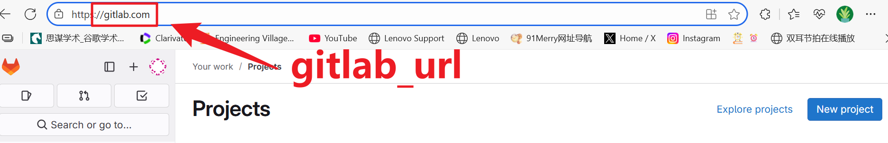

#### `gitlab_userid`
| 操作步骤 | 图示 |
|----------|------|
| 1. 点击头像 → 选择 `Edit profile` | 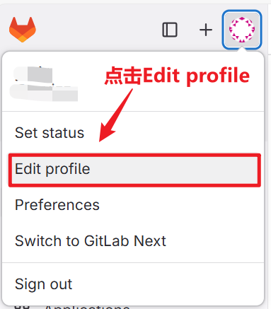 |
| 2. 下滑找到 `User ID` 并复制 | 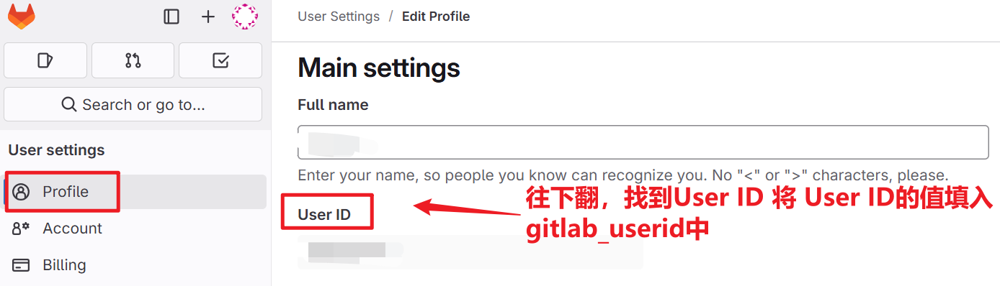 |

#### `gitlab_token`
| 操作步骤 | 关键说明 |
|----------|----------|
| 1. 进入 `Edit profile` → `Access tokens` → 创建新令牌 | 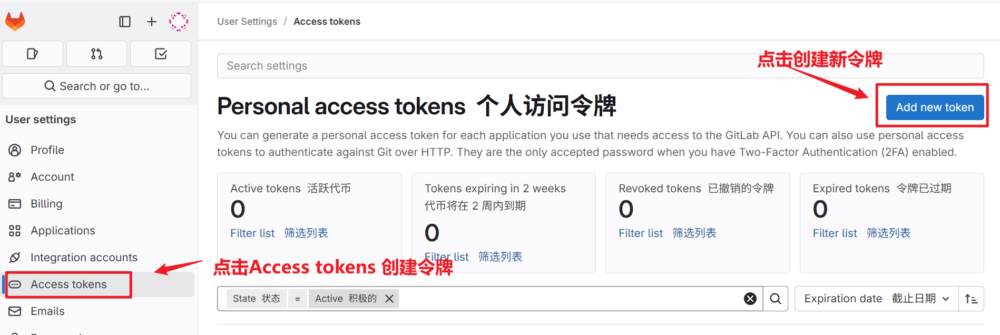 |
| 2. 配置令牌：  - 名称/描述  - 过期时间  - **必选权限**：  `api`、`read_user`、`read_repository` |  |
| 3. 复制生成的令牌填入配置 | 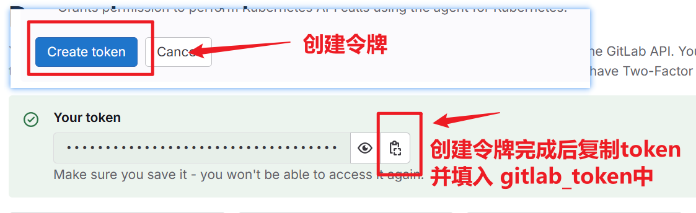 |

---

## ⏱️ WakaTime 配置
### 1. 安装插件
- **VS Code** 安装 `WakaTime` 插件  
  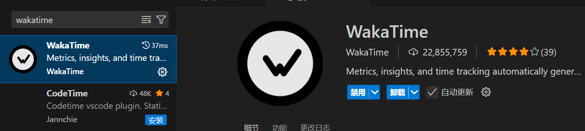

### 2. 获取 API Key
| 操作步骤 | 图示 |
|----------|------|
| 1. 登录 [WakaTime 官网](https://wakatime.com) → 点击 `Settings` | 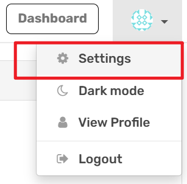 |
| 2. 复制 `Api Key` 填入配置 | 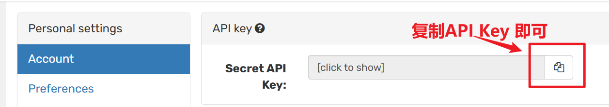 |

### 3. 配置 IDE
- 在 VS Code 中输入复制的 API Key  
  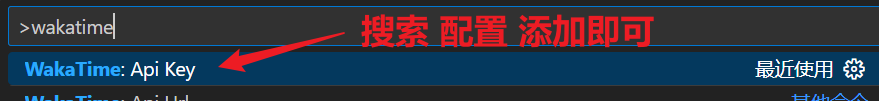

---

## 🚀 飞书配置
### 1. 获取应用凭证
#### `fs_appid` & `fs_secret`
| 操作步骤 | 关键说明 |
|----------|----------|
| 1. 进入飞书开放平台 → 创建企业自建应用 | 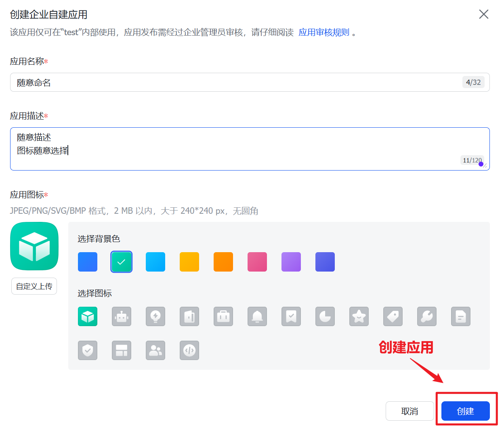 |
| 2. 配置权限：  - 应用身份：`contact:user.employee_id:readonly`  - 用户身份：`drive`/`docx`/`wiki` 相关权限 | 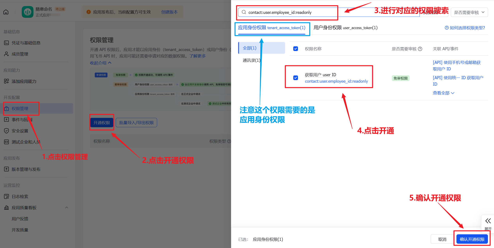 |
| 3. 安全设置中添加重定向 URL：`http://localhost:5000/api/feishu/auth/callback` | 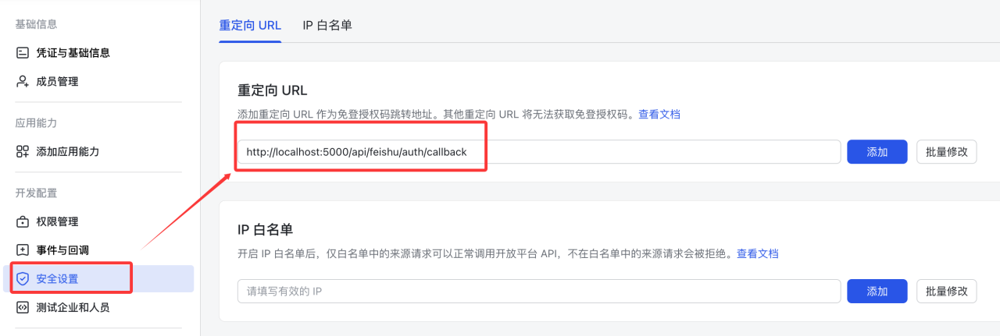 |
| 4. 在 `凭证与基础信息` 中复制 `App ID` 和 `App Secret` | 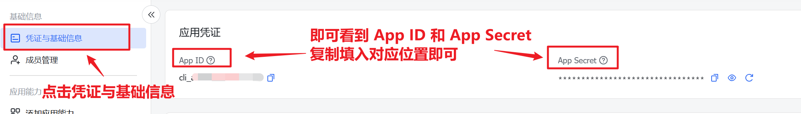 |

### 2. 配置文档空间
#### `fs_space`
| 操作步骤 | 图示 |
|----------|------|
| 1. 在飞书云文档新建/打开文档 → 浏览器打开 | 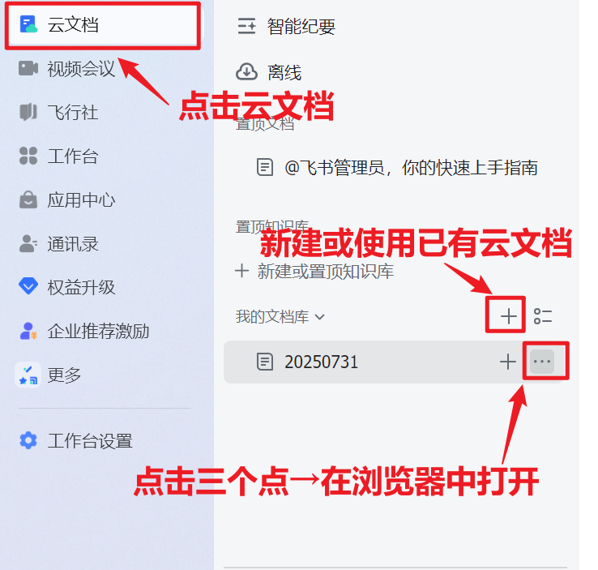 |
| 2. 复制浏览器地址栏链接 | 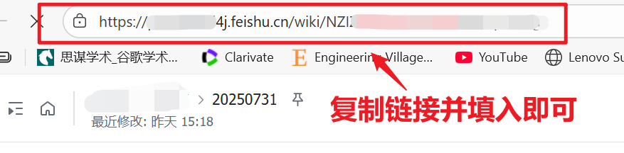 |

---

## 💡 注意事项
1. **权限申请**：飞书权限需审批通过后方可生效
2. **令牌安全**：GitLab Token 和 WakaTime API Key 需妥善保管
3. **域名配置**：企业版 GitLab 需使用内部域名