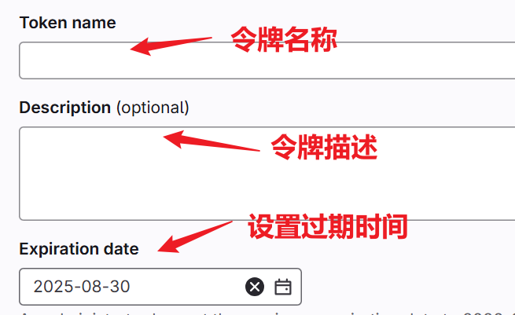
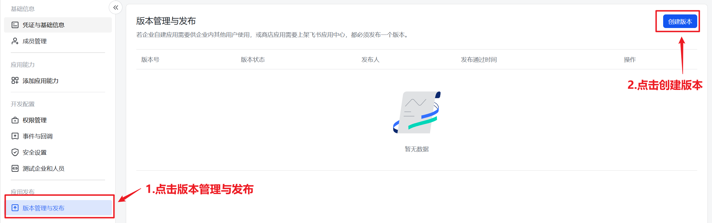
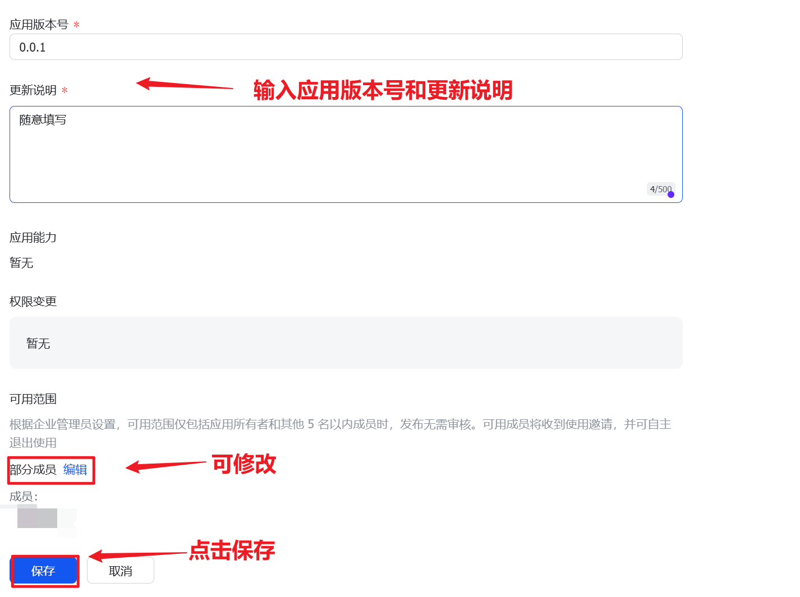

## 配置
### 获取gitlab相关配置
#### gitlab_URL
- 进入gitlab，如：

    - 一般情况下是：gitlab.com
    - 公司域名则是：gitlab.xxxx.com
#### gitlab_userid
|  第一步：点击头像 👉 选择 Edit profile  |第二步：下滑直至找到User ID 并将对应的值填入 gitlab_userid   |
| :- | :- | 
|  |    |

#### gitlab_token
- 同样点击`头像` 👉 选择 `Edit profile` 👉 点击左侧 `Access tokens` 👉 点击 `Add new token` 创建新令牌

- 输入令牌名称、描述、选择过期时间并勾选相关权限
    - `api`权限
    - `read_user`权限
    - `read_repository`权限

    |  输入令牌名称、描述，设置过期时间 |勾选相关权限  |
    | :- | :- | 
    |  |    |

- 创建令牌，并将`token`**复制**填入`gitlab_token`中

### 获取wakatime相关配置
- vscode或其他IDE中**下载插件**`WakaTime`

- 进入WakaTime官网登录/注册，并**获取** `Api Key` 并将 `Api Key` 填入 `wakatime_key`中
    - 登录注册：略
    - 获取`Api Key`如下：

    |  点击头像👉点击settings |复制Api Key 将Api Key 填入 wakatime_key中 |
    | :- | :- | 
    |  |    |

- 为vscode配置Api Key

### 获取飞书相关配置
#### fs_appid 与 fs_secret (不完善版 回调和 IP白名单还未填写)
- 自己创建飞书企业或在已有企业中
- 创建应用
    - 打开飞书 👉 点击工作台 👉 点击创建应用 👉 进入飞书开放平台

    - 点击开发者后台 👉 点击创建企业自建应用

    - 输入应用名称、应用描述，选择应用图标 👉 创建企业自建应用

    - 点击权限管理 👉 点击开通权限 👉 进行权限搜索 👉 点击开通 👉 点击确认开通权限

    - 需要的权限：
        - 应用身份权限：
            - `contact:user.employee_id:readonly` 
            - `offline_access`
        - 用户身份权限：
            - `drive:drive` 
            - `drive:drive.metadata:readonly`
            - `drive:drive:readonly`
            - `docx:document:readonly`
            - `wiki:wiki:readonly`
    - 权限勾选好后点击版本管理与发布 👉 点击创建版本
    
    - 输入应用版本号和更新说明 👉 点击保存 👉 点击确认发布 👉 等待应用通过申请
    
    - 点击凭证与基础信息 👉 复制`App ID` 和 `App Secret` 👉 分别填入 `fs_appid` 和 `fs_secret`
    
#### fs_space 

| 点击云文档 👉 新建或使用现有文档 👉 在浏览器中打开|复制浏览器中的链接 👉 填入 fs_space  |
| :- | :- | 
|  |    |
